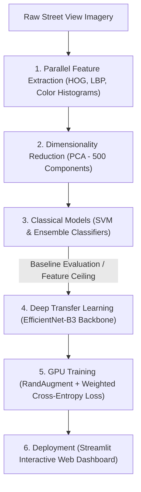

# Geo-Spatial Landscape Classifier (Geoguessr AI)

An end-to-end computer vision benchmark evaluating classical handcrafted feature extraction against deep transfer learning (EfficientNet-B3) to classify global geographic regions from street and landscape imagery. The final model is deployed via an interactive Streamlit inference web dashboard.

---

## Project Architecture



---

## Engineering Methodology & Evolution

### 1. Classical Baseline: Handcrafted Feature Pipeline
* **Feature Extraction:** Extracted texture (Local Binary Patterns), edge/structural gradients (Histogram of Oriented Gradients), and color distribution metrics in parallel across CPU cores using `joblib.Parallel`.
* **Optimization & Tuning:** Reduced feature space dimensionality via Principal Component Analysis (PCA) to 500 components and conducted automated parameter tuning using `HalvingGridSearchCV` with balanced class weights across SVM, MLP, and ensemble classifiers.
* **Observed Limitation:** Handcrafted visual features struggled to capture subtle environmental variations (e.g., foliage differences, road markings, lighting angles), establishing the benchmark and motivating a deep learning approach.

### 2. Deep Learning Pipeline: Transfer Learning with EfficientNet-B3
* **Backbone Fine-Tuning:** Transplanted and trained the classification head of a pre-trained `EfficientNet-B3` convolutional neural network in PyTorch on CUDA GPU hardware.
* **Class Imbalance Mitigation:** Dynamically computed inverse class frequencies across training splits and integrated them directly into `nn.CrossEntropyLoss(weight=...)` to prevent majority region bias.
* **Regularization & Scheduling:** Implemented `RandAugment` for robust data distortion and utilized a `CosineAnnealingLR` scheduler for stable optimization convergence.

### 3. Deployment: Streamlit Inference Application
* Built an interactive dashboard allowing users to upload landscape images and view predicted global regions along with real-time class probability distributions.

---

## Tech Stack

* **Core Frameworks:** PyTorch, Torchvision, Scikit-Learn, Streamlit
* **Computer Vision:** OpenCV, Scikit-Image, PIL
* **Data & Compute Acceleration:** NumPy, Pandas, Joblib (Multi-threading), CUDA
* **Models & Optimizers:** EfficientNet-B3, Support Vector Machines (SVM), PCA, HalvingGridSearchCV, Cosine Annealing Learning Rate Scheduler

---

## How to Run Locally

### 1. Install Dependencies
```bash
pip install torch torchvision scikit-learn opencv-python scikit-image streamlit pandas pillow tqdm joblib
```

### 2. Launch the Streamlit Dashboard
```bash
streamlit run app.py
```
